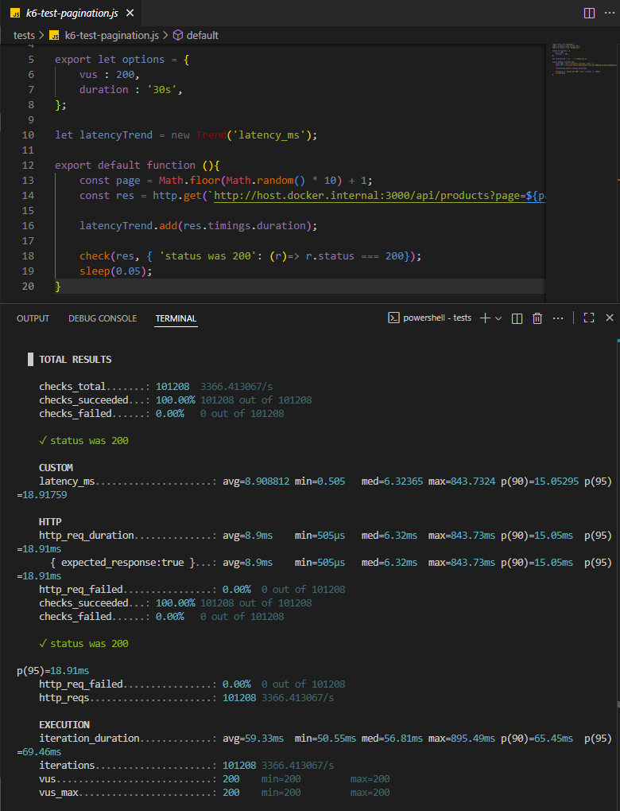
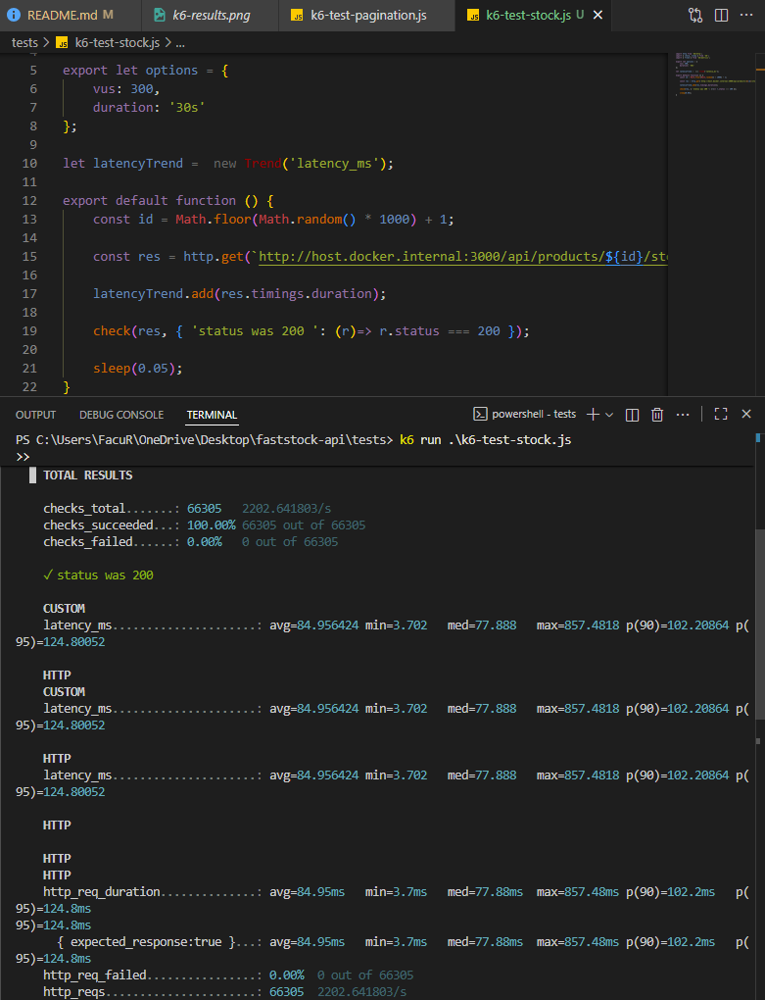
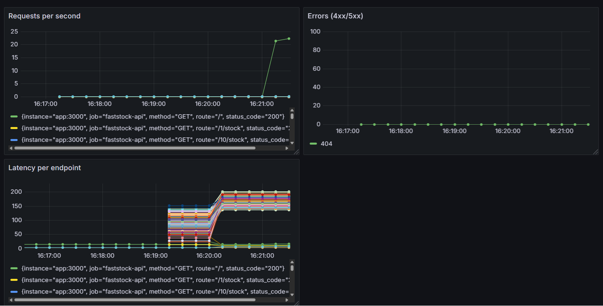

# faststock-api

## Project objective
FastStock API is a REST API designed to efficiently handle thousands of concurrent requests. The project demonstrates scale, performance, and resilience, using PostgreSQL as the data source and Redis as the cache for frequent reads.

There is no frontend: the focus is on **backend scalability and load testing**.

## Technology stack
* Node.js + Express
* PostgreSQL
* Redis
* Docker / Docker-Compose
* k6 (for load testing)

## Local installation
git clone https://github.com/SebastianRodriguezds/faststock-api
cd faststock-api
docker-compose up --build -d

## Current endpoints
* GET /api/products/:id → Get product details by ID
* GET /api/products/:id/stock → Get stock quantiy for a product
* POST /api/products/:id/update-stock → Update stock quantity for a product
Note: All frequent queries are cached in Redis to improve performance (when caching is implemented).

## Performance metrics (example)
| Metric                | Value       |
|-----------------------|-------------|
| Average latency       | 23 ms (simulated) |
| Maximum throughput    | 11.200 req/s (simulated) |
| Cache hits            | 87% (simulated) |
| CPU usage (500 VUs)   | 45% (simulated) |

## Performance metrics (real test result)
| Metric                | Value               |
|------------------------|--------------------|
| Average latency        | 8.9 ms             |
| p90 latency            | 15.05 ms           |
| p95 latency            | 18.9 ms            |
| Maximum throughput     | ~3366 req/s        |
| Total requests         | 101,208 (30s)      |
| Failed requests        | 0%**               |
| Virtual users (VUs)    | 200                |
| Test duration          | 30 seconds**       |
>These results were obtained using [k6](http://k6.io) with 200 concurrent users hitting the `/api/products?page=X&limit=10` endpoint, powered by Redis caching.

**Console output (k6 real test)**

## Performance metrics (Stock endpoint)
| Metric                 | Value              |
|------------------------|--------------------|
| Average latency        | 84.9 ms            |
| p90 latency            | 102.2 ms           |
| p95 latency            | 124.8 ms           |
| Maximum throughput     | ~2,203 req/s       |
| Total requests         | 66,305             |
| Failed requests        | 0%                 |
| Virtual users          | 300                |
| Duration               | 30s                |
>These results were obtained using [k6](http://k6.io) with 300 concurrent users hitting the `/api/products/:id/stock` endpoint, powered by Redis caching.

**Console output (k6 real test)**

## Comparison and conclusions
The /api/products enpoint (paginated list) achieves an average latency below 10ms, thanks to Redis caching and simple SELECT queries.
The /api/products/:id/stock endpoint shows higher latency(~85 ms average) since it performs more granular lookups, but remains well within acceptable limits under 300 concurrent users and > 2,200 req/s throughput.
Both endpoints maintained 0% failure rate, demonstrating good scalability and stability for read-heavy operations.

## Monitoring with Prometheus & Grafana
The API expose a /metrics endpoint that Prometheus scrapes to collect performance metrics. These metrics include:
* Requests per second per endpoint
* HTTP error counts (4xx/5xx)
* Latency per endpoint (average, p90, p95)

These metrics allow tracking the health and performance of the API under local.

Example Grafana dashboard

Requests per second, errors, and latency per endpoint during a sample load test.

By monitoring these metrics, we can identify slow endpoints, track error rates, and ensure the API maintains low latency even under high concurrency.

## Scalability
Deploy multiple API instances behind a load balancer
Use Read replicas for Redis and PostgreSQL
Run in Cluster Mode (Node.js/PM2) to take advantage of multi-core CPUs

## Fail tolerance
If Redis temporarily fails, the API continues to function by querying PostgreSQL directly. Only performance is momentarily lost.

